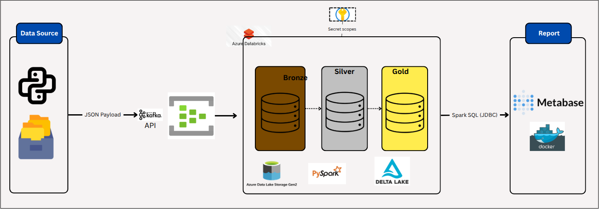
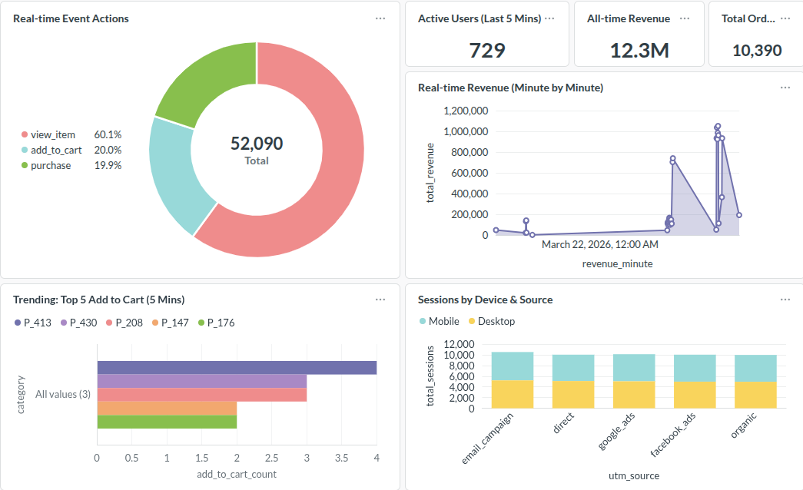

# End-to-End Real-time Clickstream Analytics Data Pipeline

     

## 📝 Business Context

In the competitive e-commerce landscape, understanding user behavior in real-time is crucial for driving sales and personalizing user experiences.
This project builds a **Real-time Data Pipeline** to ingest, process, and visualize user clickstream data (views, add-to-carts, purchases) with minimal latency. It enables business stakeholders to monitor active users, trending products, and revenue generated minute-by-minute.

## 🏗️ System Architecture



The architecture follows the **Medallion Data Lakehouse** pattern (Bronze -> Silver -> Gold) ensuring data quality, ACID compliance, and optimized performance for BI tools.

## 🛠️ Tech Stack

* **Data Simulation:** Python + Faker - Acts as thousands of users clicking on the web, continuously generating JSON data packets and sending them.
* **Ingestion:** Azure Event Hubs - Captures all data sent from Python, maintains them in safe order before pushing to the processing factory.
* **Processing:** Azure Databricks (using Spark Structured Streaming) - Continuously reads data streams from Event Hubs, filters garbage, enforces types, joins data, and calculates aggregate numbers (Windowing).
* **Storage:** Azure Data Lake Storage Gen2 - Storage for data in all states.
* **Format & Structure:** Delta Lake (Medallion architecture) - Organizes the data warehouse into 3 layers (Bronze -> Silver -> Gold) - Ensures data is not corrupted when multiple people read/write (ACID transactions).
* **Visualization:** Metabase - Directly connects (DirectQuery) to the Gold layer of Databricks to draw charts and automatically refresh every few seconds.

## 🧠 Key Data Engineering Techniques Implemented

### 1. Spark Structured Streaming & Delta Lake

* Replaced traditional batch processing with Continuous Streaming.
* Utilized Delta Lake `_delta_log` for ACID transactions, preventing data corruption during streaming interruptions.
* Implemented Checkpointing to ensure exactly-once semantics and fault tolerance.

### 2. Medallion Architecture Implementation

* 🥉 **Bronze Layer (Ingestion):** Appends raw JSON payloads directly from Event Hubs.
* 🥈 **Silver Layer (Transformation):** Unpacks JSON schemas (`from_json`), enforces data types (String to Timestamp), and filters out corrupted records (e.g., null `user_id`).
* 🥇 **Gold Layer (Consumption):** Designed for high-performance OLAP queries using a **Star Schema** approach.

### 3. Advanced Dimensional Modeling (SCD Type 1 & 2)

Used Spark's `foreachBatch` mechanism and Delta's `MERGE INTO` functionality to process micro-batches into the Star Schema:

* **Fact Table (`fact_clickstream`):** Insert-only event records.
* **Dimension Table (`dim_user` - SCD Type 1):** Upserts (Updates/Inserts) to keep only the latest user device/source information.
* **Dimension Table (`dim_product` - SCD Type 2):** Tracks historical pricing changes over time by utilizing `is_current`, `valid_from`, and `valid_to` flags, enabling accurate historical revenue calculation.

## 🚀 How to Run the Project

### Prerequisites

1. An Azure account with Event Hubs, Databricks, ADLS Gen2, and Key Vault provisioned.
2. Docker and Docker Compose installed on your local machine.
3. Python 3.10+ installed.

### Step 1: Start Data Generator (Local)

Run the Python script to simulate real-time e-commerce traffic and push it to Azure Event Hubs:

```bash
uv run data_generator/main.py
```

### Step 2: Start Databricks Pipeline (Cloud)

1. Configure Secret Scopes in Databricks CLI pointing to your Azure Key Vault.
2. Navigate to Databricks **Workflows**.
3. Create a Job containing 3 parallel tasks: `01_bronze_ingestion`, `02_silver_processing`, and `03_gold_star_schema`.
4. Click **Run Now** to start the continuous streaming jobs.

### Step 3: Launch Metabase Dashboard (Local)

Spin up the BI tool using Docker:

```bash
docker compose up -d
```

Navigate to `http://localhost:3000`, connect to Databricks using the Spark SQL driver and Personal Access Token (PAT).

## 📊 Dashboard Results



**Key Real-time Metrics Monitored:**

* 🔴 **Active Users (Last 5 mins):** Counts unique users interacting with the site within a rolling 5-minute window.
* 💰 **Minute-by-Minute Revenue:** An area chart showing the cumulative revenue generated from 'purchase' events, updating every minute.
* 🔥 **Trending Products:** A horizontal bar chart identifying the Top 5 products added to cart in the last 5 minutes.
* 🌐 **Traffic Source Distribution:** A stacked bar chart visualizing the split between device types (Mobile/Desktop) and UTM sources (Google/Facebook/Direct).
* ⭐ **Order Value (AOV) & Total Orders:** Small cards showing overall e-commerce health, recalculating with every new micro-batch.

Live view of the Clickstream Realtime Dashboard. Each chart is configured with a 1-minute auto-refresh rate, reflecting data flowing through the Gold layer directly from Event Hubs.
