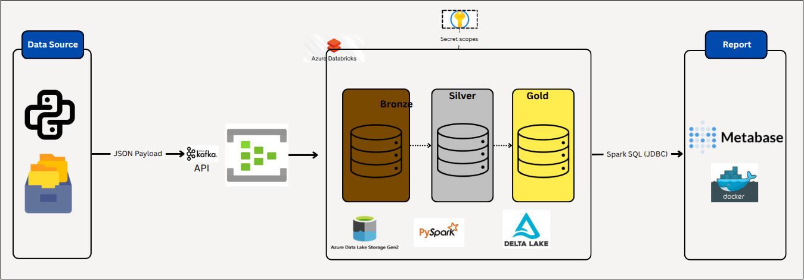
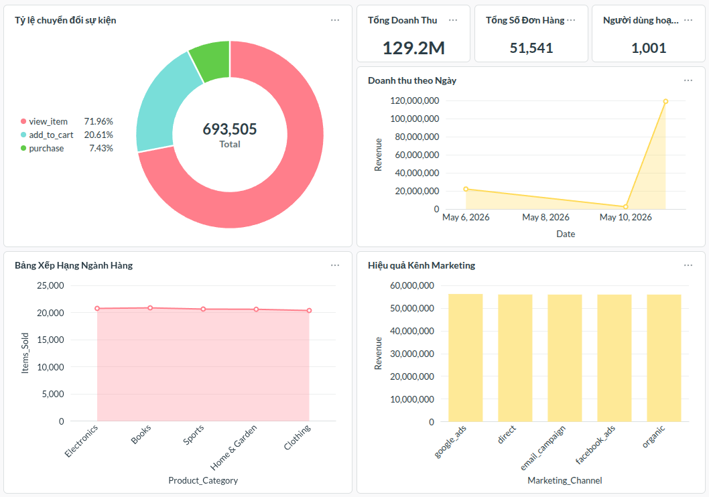

# End-to-End Real-time Clickstream Analytics Data Pipeline

     

## 📝 Business Context

In the competitive e-commerce landscape, understanding user behavior in real-time is crucial for driving sales and personalizing user experiences.
This project builds a **Real-time Data Pipeline** to ingest, process, and visualize user clickstream data (views, add-to-carts, purchases) with minimal latency. It enables business stakeholders to monitor active users, trending products, and revenue generated minute-by-minute.

## 🏗️ System Architecture



The architecture follows the **Medallion Data Lakehouse** pattern (Bronze -> Silver -> Gold) ensuring data quality, ACID compliance, and optimized performance for BI tools.

## 🛠️ Tech Stack

* **Data Simulation:** Python + Faker - Acts as thousands of users clicking on the web, continuously generating JSON data packets and sending them.
* **Ingestion:** Azure Event Hubs - Captures all data sent from Python, maintains them in safe order before pushing to the processing factory.
* **Processing:** Azure Databricks (using Spark Structured Streaming) - Continuously reads data streams from Event Hubs, filters garbage, enforces types, joins data, and calculates aggregate numbers (Windowing).
* **Storage:** Azure Data Lake Storage Gen2 - Storage for data in all states.
* **Format & Structure:** Delta Lake (Medallion architecture) - Organizes the data warehouse into 3 layers (Bronze -> Silver -> Gold) - Ensures data is not corrupted when multiple people read/write (ACID transactions).
* **Visualization:** Metabase - Directly connects (DirectQuery) to the Gold layer of Databricks to draw charts and automatically refresh every few seconds.

## 🧠 Key Data Engineering Techniques Implemented

### 1. Data Simulation and Ingestion Methods

#### **Realistic Clickstream Event Generation**
The project implements a sophisticated data generator that simulates realistic e-commerce user behavior with stateful session management, behavior-driven action flows, and intentional dirty data injection to test data quality pipelines.

**Key Techniques:**
- **Stateful Session Management** with Garbage Collection: Maintains up to 5,000 active user sessions in-memory, automatically evicting oldest sessions to prevent memory leaks while creating realistic user journeys.
- **Behavior-Driven Action Flows**: Implements state-machine logic where user actions follow realistic patterns (70% continue browsing after viewing, 30% add to cart; 40% checkout after adding to cart).
- **Late Event Injection**: Simulates real-world network delays with 75% on-time events and 25% late arrivals (up to 30 seconds) to test watermarking capabilities.
- **Intentional Dirty Data Injection** (5% error rate): Tests data quality by injecting null values, invalid prices, type mismatches, and schema drift.

#### **Azure Event Hubs Integration**
Uses batching mechanism with automatic overflow handling and traffic spike simulation (50-100 events/sec normally, with occasional 3-5x multipliers) to test streaming performance during peak loads.

### 2. Streaming Processing Approaches

#### **Bronze Layer: Raw Ingestion with Checkpointing**
- **Kafka Source Integration**: Connects to Azure Event Hubs using Kafka-compatible endpoints with SASL/SSL authentication.
- **Fault-Tolerant Configuration**: `failOnDataLoss: false` gracefully handles Event Hub retention policy by continuing from latest offset.
- **10-Second Micro-batching**: Balances latency (~10s) with throughput by processing in 10-second windows.
- **Checkpointing**: Records offset progress in ADLS, enabling exactly-once delivery semantics and crash recovery.

#### **Silver Layer: Data Quality & Streaming Transformations**
- **JSON Schema Validation**: Uses `from_json` with `_corrupt_record` column to capture malformed JSON instead of failing the pipeline.
- **Multi-condition Filtering**: Four independent validation gates (corrupt JSON, missing user_id, invalid price, bot traffic) catch 95%+ of bad records.
- **Watermarking**: Allows 10-minute late arrivals before closing windows, critical for delayed events from slow networks.
- **Deduplication**: Removes duplicate `event_id` records within the watermark period.
- **Dead Letter Queue (DLQ)**: Routes bad records to a separate table with error classification for debugging and audit trails.

### 3. Data Lakehouse Architecture Patterns

#### **Medallion Three-Layer Architecture**
Implements clean separation of concerns across Bronze (raw), Silver (validated), and Gold (optimized) layers using Delta Lake for ACID transactions, schema evolution, time-travel auditing, and automatic compaction.

| Layer | Purpose | Schema | Access |
|-------|---------|--------|--------|
| **Bronze** | Preserve raw data as-is | `raw_payload`, `ingestion_timestamp` | Data engineers, debuggers |
| **Silver** | Enforce quality & types | Parsed JSON with typed columns | Data analysts, transforms |
| **Gold** | OLAP-optimized Star Schema | Fact + 5 Dimensions | BI tools, dashboards |

### 4. Advanced Dimensional Modeling (SCD Type 1 & 2)

#### **Star Schema: 1 Fact + 5 Dimensions**
Uses Spark's `foreachBatch` mechanism and Delta's `MERGE INTO` functionality to process micro-batches into an optimized Star Schema.

- **Fact Table (`fact_events`)**: Insert-only immutable event records with net revenue calculation `(price * quantity) - discount`.
- **Dimension Users (SCD Type 1)**: Overwrite-only dimension keeping latest device/OS info, no historical tracking.
- **Dimension Products (SCD Type 2)**: Tracks historical category changes using `is_current`, `start_date`, and `end_date` flags for accurate historical revenue calculation.
- **Supporting Dimensions**: Date (conformed for time aggregations), Location (MD5 composite key), Sessions (marketing attribution).

### 5. Spark, Delta Lake, and Azure Services Usage

#### **Spark Structured Streaming Pattern**
- **Reading**: `spark.readStream.format("kafka")` with Event Hubs integration
- **Writing**: `writeStream.format("delta").outputMode("append")` with checkpointing
- **foreachBatch**: Enables complex SCD logic and idempotent MERGE operations per micro-batch

#### **Azure Integration**
- **Event Hubs**: Kafka-compatible messaging with 24-hour retention and automatic partitioning
- **ADLS Gen2**: Hierarchical storage with `abfss://` protocol for Delta Lake compatibility
- **Databricks**: Pre-configured Spark clusters with Secret Scopes for Key Vault integration

### 6. Error Handling, Fault Tolerance, and Data Quality Measures

#### **Fault Tolerance Mechanisms**
- **Checkpointing at Every Layer**: Bronze, Silver, and Gold layers maintain separate checkpoints for exactly-once semantics
- **Delta Lake ACID Transactions**: Prevents partial writes and ensures data consistency during failures
- **Event Hub Resilience**: Graceful handling of data loss scenarios without pipeline interruption

#### **Data Quality Implementation**
- **Multi-Layer Validation**: JSON parsing, type enforcement, and business rule validation
- **Dead Letter Queue**: Separate stream for bad records with error classification
- **Watermarking & Deduplication**: Handles late arrivals and prevents duplicate processing
- **Real-time Monitoring**: DLQ analysis and BI dashboard metrics for pipeline health

## 🚀 How to Run the Project

### Prerequisites

1. An Azure account with Event Hubs, Databricks, ADLS Gen2, and Key Vault provisioned.
2. Docker and Docker Compose installed on your local machine.
3. Python 3.10+ installed.

### Step 1: Start Data Generator (Local)

Run the Python script to simulate real-time e-commerce traffic and push it to Azure Event Hubs:

```bash
uv run data_generator/main.py
```

### Step 2: Start Databricks Pipeline (Cloud)

1. Configure Secret Scopes in Databricks CLI pointing to your Azure Key Vault.
2. Navigate to Databricks **Workflows**.
3. Create a Job containing 3 parallel tasks: `01_bronze_ingestion`, `02_silver_processing`, and `03_gold_star_schema`.
4. Click **Run Now** to start the continuous streaming jobs.

### Step 3: Launch Metabase Dashboard (Local)

Spin up the BI tool using Docker:

```bash
docker compose up -d
```

Navigate to `http://localhost:3000`, connect to Databricks using the Spark SQL driver and Personal Access Token (PAT).

## 📊 Dashboard Results



**Key Real-time Metrics Monitored:**

* 🔴 **Active Users (Last 5 mins):** Counts unique users interacting with the site within a rolling 5-minute window.
* 💰 **Minute-by-Minute Revenue:** An area chart showing the cumulative revenue generated from 'purchase' events, updating every minute.
* 🔥 **Trending Products:** A horizontal bar chart identifying the Top 5 products added to cart in the last 5 minutes.
* 🌐 **Traffic Source Distribution:** A stacked bar chart visualizing the split between device types (Mobile/Desktop) and UTM sources (Google/Facebook/Direct).
* ⭐ **Order Value (AOV) & Total Orders:** Small cards showing overall e-commerce health, recalculating with every new micro-batch.

Live view of the Clickstream Realtime Dashboard. Each chart is configured with a 1-minute auto-refresh rate, reflecting data flowing through the Gold layer directly from Event Hubs.
